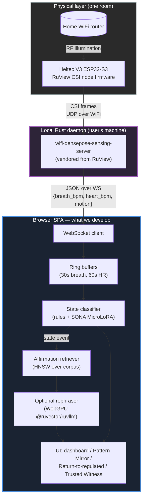
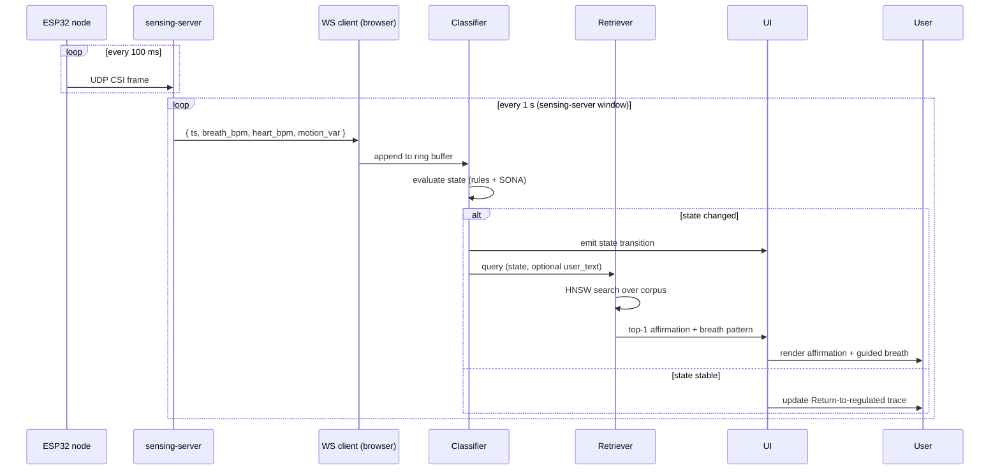

# MindRefreshStudio — System Architecture

**Status:** Draft. Aligned with `docs/02_research/02_ruview_integration_strategy.md` (final architecture decision).
**Last updated:** 2026-04-25 (Build Day 2)

---

## 1. One-paragraph scope

MindRefreshStudio is a single-page React web app that connects to a locally-running RuView Rust sensing server over WebSocket. The sensing server reads ESP32-S3 WiFi CSI from a Heltec V3 node and emits breath rate, heart rate, and motion. The browser classifies the user's nervous-system state (regulated / rising / activated / shutdown) using a transparent rule table (warm-started) and a SONA MicroLoRA personalization layer (refined per user). On state transitions, the app retrieves a state-matched somatic affirmation from a local HNSW index and renders it with a matched breath pattern. No data leaves the device.

---

## 2. Build vs. vendor

| Layer | We build | We vendor |
|---|---|---|
| ESP32 firmware | — | `upstream/RuView/firmware/esp32-csi-node` (flash as-is) |
| CSI → vital signs | — | `upstream/RuView/v2/crates/wifi-densepose-sensing-server` (run as-is, listens on `ws://localhost:8765/ws/sensing`) |
| State classifier | rule table + SONA hook | `@ruvector/sona` |
| Affirmation retrieval | 20-entry somatic corpus + service + optional rephraser | `@ruvector/core` (HNSW), `@ruvector/ruvllm` (optional WebGPU rephrase) |
| UI shell | landing + dashboard + Pattern Mirror + Return-to-regulated + Trusted Witness | shadcn/ui, Tailwind, lucide, `react-router-dom`, `@tanstack/react-query` |
| Privacy attestation | thin wrapper (only if Day 6 budget allows) | RVF witness chain |

---

## 3. System architecture (high-level)



**Trust boundary:** the dashed line between Browser and LocalDaemon. Both run on the user's own machine. The router is the user's existing AP; ESP32 connects to it as a regular station. Nothing crosses the network boundary outward.

---

## 4. Data flow — CSI to intervention



State transitions are debounced (≥5 s minimum dwell) to avoid flicker. User-initiated check-ins ("type one sentence about what's alive") trigger an immediate retrieval bypassing the dwell rule.

---

## 5. DDD bounded contexts

```mermaid
flowchart LR
    subgraph Sensing["Sensing context"]
        direction TB
        A1[WSClient]
        A2[VitalsStream]
        A3[VitalsRingBuffer]
    end
    subgraph State["State context"]
        direction TB
        B1[StateRules]
        B2[StateClassifier]
        B3[StateTransitionStream]
    end
    subgraph Intervention["Intervention context"]
        direction TB
        C1[AffirmationCorpus]
        C2[AffirmationRetriever]
        C3[BreathPatternLibrary]
        C4[Rephraser]
    end
    subgraph Memory["Memory context"]
        direction TB
        D1[SessionStore]
        D2[PatternMirror]
        D3[ReturnToRegulatedTrace]
    end
    subgraph Personalization["Personalization context"]
        direction TB
        E1[SonaTrajectory]
        E2[MicroLoRA]
    end

    Sensing -- "Vitals event" --> State
    State -- "State transition event" --> Intervention
    State -- "State sample" --> Memory
    Intervention -- "Intervention rendered" --> Memory
    Memory -- "User feedback signal" --> Personalization
    Personalization -- "Updated weights" --> State

    style Sensing fill:#1f3a4d,color:#fff
    style State fill:#3d2c4d,color:#fff
    style Intervention fill:#2c3d3d,color:#fff
    style Memory fill:#3d3d2c,color:#fff
    style Personalization fill:#3d2c2c,color:#fff
```



**Contracts (public surface of each context):**
- `Sensing.subscribe(callback: (Vitals) => void): Unsubscribe`
- `State.subscribe(callback: (StateTransition) => void): Unsubscribe`
- `Intervention.retrieve(state, userText?): Promise<Intervention>`
- `Memory.appendSample(Vitals | StateTransition | Intervention)`
- `Personalization.recordFeedback(transitionId, signal: 'helped' | 'neutral' | 'unhelpful')`

Contexts only know each other through these contracts. Tests mock at the contract boundary (London-school).

---

## 6. Privacy boundary

```mermaid
flowchart TD
    subgraph Home["User's home — trust zone"]
        ESP["ESP32 sensor"]
        Server["sensing-server (Rust)"]
        Browser["Browser SPA"]
        Disk["IndexedDB<br/>(session history,<br/>SONA weights)"]
    end

    subgraph External["Outside — never crossed"]
        Cloud[("Any cloud")]
        Server3rd[("Any 3rd-party server")]
    end

    ESP --> Server
    Server --> Browser
    Browser --> Disk
    Disk --> Browser

    Browser -. blocked .x Cloud
    Server -. blocked .x Server3rd

    style External fill:#3a1f1f,color:#fff,stroke:#e74c3c,stroke-width:2px
    style Home fill:#1f3a1f,color:#fff,stroke:#2ecc71,stroke-width:2px
```

**Promise:** raw CSI never leaves the sensing-server process. Vitals frames never leave the browser. Affirmation retrieval is local (HNSW in-browser); optional rephrasing is local (WebGPU). No analytics, no telemetry, no cloud LLM calls. Privacy is structural, not policy-based.

The "Trusted Witness" feature is the single deliberate exception: a one-tap message to a pre-chosen support person during sustained dysregulation. It uses the device's native share sheet (SMS / iMessage / Signal) — *we* never see the message and never operate the relay.

---

## 7. Source layout (the code we actually write)

```
src/
  App.tsx                      # provider stack (Query, Tooltip, Toaster, Router)
  main.tsx
  index.css
  nav-items.ts                 # route registry
  pages/
    Landing.tsx                # public landing, somatic narrative
    Dashboard.tsx              # live state + Pattern Mirror + trace
    Sensing.tsx                # ESP32 connection & calibration view
    NotFound.tsx
  components/
    layout/
      Header.tsx               # sticky, route-aware
      Sidebar.tsx
      Footer.tsx
    landing/
      Hero.tsx                 # somatic narrative, not retro-terminal
      HowItWorks.tsx
      PrivacyPromise.tsx
    dashboard/
      StateBadge.tsx           # current state chip
      VitalsPanel.tsx          # breath + HR sparklines
      ReturnToRegulatedTrace.tsx
      PatternMirror.tsx        # 7-day state heatmap
      TrustedWitnessButton.tsx
    intervention/
      AffirmationCard.tsx      # ported from mind-refresh-05
      BreathGuide.tsx          # animated state-matched breath pattern
      WhatsAliveInput.tsx      # user types one sentence
    ui/                        # shadcn primitives (vendored)
  contexts/
    SensingContext.tsx         # Sensing bounded context
    StateContext.tsx           # State bounded context
    InterventionContext.tsx    # Intervention bounded context
  services/
    wsClient.ts                # WebSocket → sensing-server
    vitalsRingBuffer.ts
    stateRules.ts              # rule-table classifier
    stateClassifier.ts         # combines rules + SONA
    affirmationRetriever.ts    # HNSW wrapper around @ruvector/core
    rephraser.ts               # optional WebGPU @ruvector/ruvllm
    sonaPersonalization.ts     # @ruvector/sona trajectory hooks
    sessionStore.ts            # IndexedDB wrapper
  data/
    affirmations.json          # 20 somatic affirmations (4 states × 5)
    breathPatterns.json        # 4 breath patterns (one per state)
    stateRules.json            # rule thresholds (HR, breath, motion)
  types/
    vitals.ts
    state.ts
    intervention.ts
    session.ts
  hooks/
    useVitals.ts
    useState.ts
    useIntervention.ts
  test/
    fixtures/
      recorded-csi-session.json   # demo fallback
```

Files prefixed with names already-present in `upstream/mind-refresh-05/src/` are intentional ports — we lift the shape, then rewrite the content.

---

## 8. What the architecture deliberately omits

- **Tauri / desktop shell.** No precedent in surveyed Ruv React repos; Vercel-deployed SPA is the submission artifact. ([doc 02 §4](../02_research/02_ruview_integration_strategy.md))
- **Node bridge between sensing-server and browser.** Sensing-server already speaks WebSocket. ([doc 02, decision flip 3](../02_research/02_ruview_integration_strategy.md))
- **Cloud LLM API.** Affirmation rephrasing runs locally on WebGPU or is skipped.
- **HRV computation.** Cut for honesty — ESP32 CSI is not reliable enough in 8 days. ([doc 02 §6](../02_research/02_ruview_integration_strategy.md))
- **Multi-node CSI mesh.** Single-node deployment per the supplied BOM. Spatial resolution is "good enough for state classification, not good enough for pose."
- **Pose estimation.** RuView supports 17-keypoint pose; we use none of it. Wrong product.

---

## 9. Day-2 risk gate (today)

This architecture is contingent on `wifi-densepose-sensing-server` building cleanly on macOS. Until that is verified, every diagram above is a hypothesis.

```bash
cd upstream/RuView/v2
cargo build -p wifi-densepose-sensing-server
```

Pass = proceed with this architecture. Fail = revert to `docs/02_research/01_winning_strategy.md` plan and write a fast `ADR-005-ruview-build-failed.md` documenting the pivot.

---

## 10. Cross-references

- Strategic rationale: `docs/02_research/01_winning_strategy.md`
- RuView integration analysis: `docs/02_research/02_ruview_integration_strategy.md`
- Problem statement: `docs/01_initial/01_problem.md`
- Hackathon brief & rubric: `docs/01_initial/02_buildathon.md`
- Sensor BOM: `docs/01_initial/03_sensor.md`
